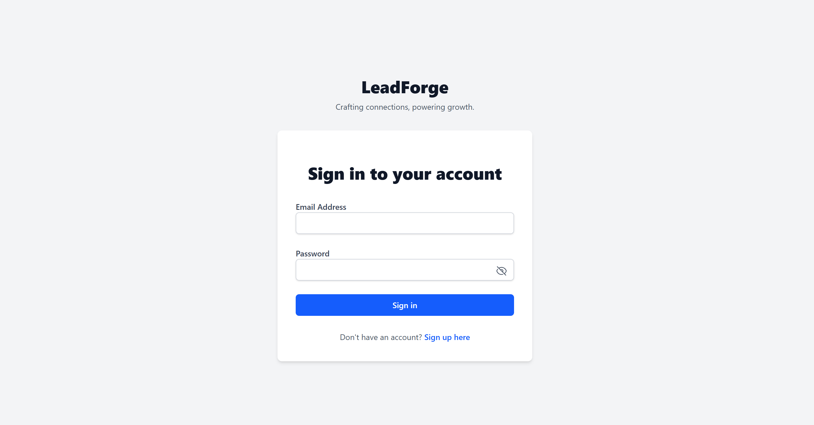

# 📈 LeadForge

A full-stack Lead Management System built with React, Tailwind CSS, React Router, and Spring Boot backend. It provides a clean, responsive dashboard with sidebar navigation, real-time lead statistics, and detailed lead management features.

**Tagline:** _"Crafting connections, powering growth."_

---

### 🚀 Live Demo

🔗 [Deployed Live on Vercel](https://inventory-pilot-frontend.vercel.app/)<br/>

📡 [Backend Deploy Link](https://inventorypilot-backend-ib2e.onrender.com)

---

## Watch Demo video :- 

[Watch the video](https://drive.google.com/file/d/1pwjcZbnt9LUFZHhYAgnXlLwYSfPuPMSS/view?usp=sharing)

---


## 🌟 Features

- Responsive sidebar navigation with expandable/collapsible functionality.
- Dynamic dashboard displaying total leads, new leads, qualified leads, and total value.
- Color-coded lead statuses for clear visualization.
- Authentication and authorization based on JWT tokens.
- React Router v6 nested layout using Outlet for content rendering.
- CRUD operations for leads with server-side API integration.
- User-friendly interface with hamburger menu toggle for sidebar.
- Styled with Tailwind CSS and Heroicons for modern UI.

---

## 📁 Tech Stack

- **Frontend:** React.js, Tailwind CSS, React Router, Tailwind CSS, Heroicons, AG Grid, Axios, React Hot Toast, Vite
- **Backend:** Node.js, Express.js, axios, bcrypt, cors, cookie-parser, dotenv, express-validator, nodemon
- **Database:** MongoDB

---

## 🔧 Getting Started

### 1. Clone the repo (frontend and backend)

```bash
git clone https://github.com/atharva5924/LeadForge.git
```

---

### 2. Backend Setup

In backend directory:

```bash
cd server
```

- Create `.env` file with:

```env
PORT=5000
MONGODB_URI=your_mongodb_connection_string_here
JWT_SECRET=your_secret_jwt_key_here_make_it_long_and_secure
NODE_ENV=your_environment_here_development_or_production
```

```bash
- Install dependencies and run:
npm install
npm run dev # or npm start if configured
```

---

### 3. Frontend Setup

In frontend directory:

- Create `.env` file with:

```env
VITE_API_BASE_URL=http://localhost:5000/api
```

```bash
- Install dependencies and run dev server:
npm install
npm run dev
```

Frontend runs at `http://localhost:3000/`

---

## Database Seeding

This project includes a seed data script to quickly populate the database with sample leads, users, and related data for testing and development purposes.

### How to Seed Data

1. Ensure your database (MongoDB/MySQL/etc.) is running and accessible.

2. Run the seed script located at:

```bash
/server/scripts/seedData.js
```
Adjust path if needed depending on repository structure)

3. To execute the seed script:

- For Node.js (MongoDB):
  ```
  node server/scripts/seedData.js
  ```

4. The seed script inserts initial test data including:
- Sample leads with various statuses and values
- User accounts with roles and secure hashed passwords
- Associated metadata needed for app functionality

5. After seeding, restart the backend server if it was running to reflect the updated data.

---

Seeding the database helps get the application up and running quickly with realistic sample data, enabling faster testing and development.

---

## 📄 Database Schema

This project uses predefined SQL schemas for all tables to ensure data consistency and integrity.

- The database schema includes tables for `users`, `investment_products`, `investments`, and `transaction_logs`.
- The full SQL schema definitions are part of the backend initialization script located in `config/database.js` which creates tables if they do not exist.
- Key schema features:
  - User management with role-based access (`users` table)
  - Detailed investment product catalog (`investment_products` table)
  - User investments with transaction history (`investments` table)
  - Comprehensive API transaction logging (`transaction_logs` table)

For complete clarity, see the schema code in [`config/database.js`](./backend/config/database.js).

---

## 📦 API Endpoints

### Authentication
| Method | Endpoint                          | Description                           |
| ------ | -------------------------------- | ------------------------------------- |
| POST   | `/api/auth/register`              | Register a new user                   |
| POST   | `/api/auth/login`                 | User login                           |
| POST   | `/api/auth/logout`                | Logout user (clears auth token)     |
| GET    | `/api/auth/me`                   | Get current logged-in user profile   |

### Leads
| Method | Endpoint                    | Description                          |
| ------ | --------------------------- | ------------------------------------ |
| GET    | `/api/leads`                | Get list of leads (filterable)      |
| GET    | `/api/leads/:id`            | Get lead details by ID               |
| POST   | `/api/leads`                | Create a new lead                   |
| PUT    | `/api/leads/:id`            | Update lead by ID                   |
| DELETE | `/api/leads/:id`            | Delete lead by ID                   |

### Dashboard
| Method | Endpoint                  | Description                          |
| ------ | ------------------------- | ------------------------------------ |
| GET    | `/api/dashboard/stats`    | Get lead statistics for dashboard    |

---

## 🧩 Screenshots

*Note: The data shown in the screenshots below is pre-inserted for demonstrating features and ensuring a clear visual representation.*

### 🔐 Login
User authentication with JWT tokens.  


---

### 📝 Register
Register new users with role assignment.  


---

### 🔒 Reset Password
Reset password securely using email link tokens.  


---

### 📊 Dashboard
Overview of leads with stats and recent activity.  


---

### 🗂 Leads Management
View, add, update, or delete leads with status indicators.  


Create Leads

Update Leads

Delete Leads


---

### ⚙️ Settings/Profile
View and update user profile and preferences.  


---

## 👨‍💻 Developer

**Atharva Nile**
CSE Undergrad @ IIIT Nagpur
📧 nileatharva20@gmail.com
🔗 [LinkedIn](https://www.linkedin.com/in/atharva-nile-a50120294) • [GitHub](https://github.com/atharva5924)

---

## License

[MIT](LICENSE)

---

## Notes

- Ensure backend server is running and API base URL is correctly configured.
- For frontend UI, toggle sidebar via hamburger menu and navigate using sidebar links.
- Authentication tokens are securely stored and managed on the client side.
- Use API testing tools like Postman with JWT tokens to test endpoints.
- Use Postman or similar tools to test API endpoints; include JWT tokens in the header.

---

Let me know if you want:

- A Hindi/Marathi short version.
- Custom badges or GIF recording.

I'll tailor the README further based on your preferences or interviewer expectations.

Feel free to reach out if you need setup help or additional instructions!

---
